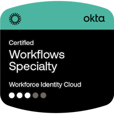

# About Me
Hi there! I graduated from the College of the Holy Cross with a bachelor's degree in computer science and a minor in philosophy. 
I currently work at **Mantra Computing** as an IT consultant. My ultimate goal is to work in software development.

## Past Projects
- IggyBot/IggyPy -- A multifunction Discord bot designed specifically for the Crusader Gaming Hub server. This bot handles user verification, high-priority announcement delivery, poll management, and other minor functions.
- Rust Truth Table Generator -- Originally produced as a term project for a course in programming languages design and implementation, highlighting Rust. 
- Geolocation Cluster -- A project for my Computer Networking course which involved estimating a user's distance from a specified web server based on observed latency from several worker nodes in various datacenters. 

## Technical Proficiencies  

## Certifications

## Contact Information
**Email + Slack:** evo@fearn.li  
**Discord:** @evo_f

<!--
**Evo-F/Evo-F** is a ✨ _special_ ✨ repository because its `README.md` (this file) appears on your GitHub profile.

Here are some ideas to get you started:

- 🔭 I’m currently working on ...
- 🌱 I’m currently learning ...
- 👯 I’m looking to collaborate on ...
- 🤔 I’m looking for help with ...
- 💬 Ask me about ...
- 📫 How to reach me: ...
- 😄 Pronouns: ...
- ⚡ Fun fact: ...
-->
